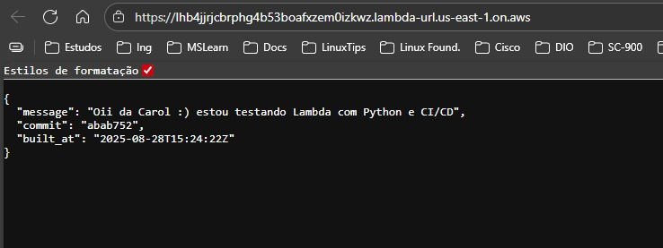
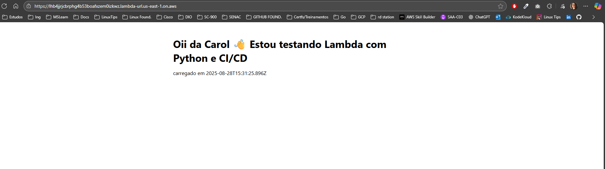

# CI/CD com GitHub Actions e AWS Lambda (Python)

Este repositório foi usado como **estudo prático** para praticar a integração de **GitHub Actions** com **AWS Lambda**, criando um fluxo de CI/CD simples em Python e testando a exposição da função via **Function URL**.

---

## Fluxo CI/CD

- **Build & Test**
  - Lint básico do código (`python -m py_compile`).
  - Empacotamento (`zip`) do `handler.py` e arquivos estáticos (HTML/CSS/JS).
  - Upload do artefato para ser usado no deploy.

- **Deploy**
  - Assume role no AWS com **OIDC** (GitHub Actions → AWS IAM).
  - Ajusta configuração da Lambda (`runtime = python3.13`, `handler = handler.handler`, variáveis `GIT_SHA` e `BUILT_AT`).
  - Faz upload do ZIP com o código.
  - Cria/atualiza o alias **`prod`**.
  - Aguarda a Lambda ficar `Active`.
  - Invoca a função para validar direto no pipeline (JSON de resposta).

---

## Validação no Pipeline

Antes de expor a Lambda publicamente, a validação foi feita direto nos logs do GitHub Actions.  
O invoke retornava algo como:

```json
{
  "statusCode": 200,
  "headers": {"Content-Type": "application/json"},
  "body": "{\"message\": \"Oii da Carol :) estou testando Lambda com Python e CI/CD\", \"commit\": \"55b3bf4\", \"built_at\": \"2025-08-28T15:12:34Z\"}"
}
```

Isso já confirmava que o deploy estava funcionando corretamente.

---

## Function URL

Na sequência, foi criada uma **Lambda Function URL** para abrir no navegador.  

### Demonstração 
1. **Versão JSON**: resposta básica via invoke.  
   

2. **Versão HTML**: página simples servida pela Lambda através da URL pública.  
   

---

## 🔐 Boas práticas aplicadas

- Uso de **OIDC (OpenID Connect)** para integrar GitHub Actions e AWS sem precisar de Access Keys fixas.
- Criação de uma **policy inline granular** para a role `github-actions-deploy`, contendo apenas as permissões necessárias:
  - `lambda:UpdateFunctionConfiguration`
  - `lambda:UpdateFunctionCode`
  - `lambda:PublishVersion`
  - `lambda:GetFunction`
  - `lambda:GetAlias`
  - `lambda:CreateAlias`
  - `lambda:UpdateAlias`
  - `lambda:GetFunctionUrlConfig`
  - `lambda:InvokeFunction`
  - `lambda:InvokeFunctionUrl`

Dessa forma, a role tinha apenas os privilégios mínimos exigidos pelo pipeline.

---

## 📚 Aprendizados

- Como estruturar um workflow GitHub Actions para Lambda.
- Como validar o deploy no próprio pipeline antes de expor publicamente.
- Diferença entre `AWS_IAM` e `NONE` em Function URL.
- Políticas IAM **granulares** para segurança.

---

## Licença

Este projeto é distribuído sob a licença MIT. Veja o arquivo [LICENSE](LICENSE) para mais detalhes.
